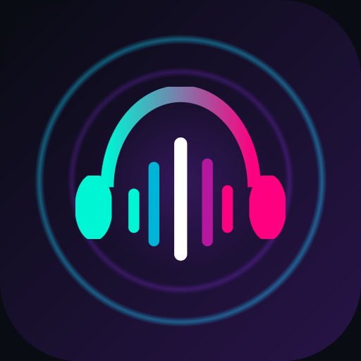

<p align="center">
  
</p>

<h1 align="center">Muesic</h1>

<p align="center">
  <strong>Your music, your device, your privacy.</strong><br>
  A modern, high-fidelity Android streaming music player built with Jetpack Compose & Material 3. Stream millions of tracks at up to 320 kbps with zero ads, zero trackers, and no required accounts or API keys.
</p>

<p align="center">
  
  
  
  
  
  
</p>

---

## 📖 About Muesic

**Muesic** is an independent, client-side open music application designed for listeners who want complete ownership over their listening experience. Unlike conventional streaming services, Muesic requires **no subscriptions, no logins, and no personal data collection**. It connects directly to public music streams (JioSaavn and YouTube / YouTube Music) to deliver crisp 320 kbps audio straight to your headphones, paired with a local Room database to maintain your playlists, play history, and cached songs safely on your device.

---

## ✨ Currently Existing Features

### 🎧 1. Dual Online Streaming Engines
- 🎵 **Direct JioSaavn Streaming**: Instant search and direct streaming of millions of Bollywood, regional (Punjabi, Tamil, Telugu, Malayalam, Bengali), and international tracks at up to **320 kbps** with zero authentication.
- 📺 **Headless YouTube & YouTube Music Engine**: Seamlessly searches and plays tracks from YouTube & YouTube Music in the background with lock screen playback and no video interference.
- 🔍 **Unified Multi-Source Search**: Switch between *All Sources*, *JioSaavn*, *YouTube Music*, and *YouTube* with a single tap, complete with instant search history and auto-suggestions.

### 🌟 2. Dynamic Discover & Smart Feeds
- 🔥 **Trending Hits**: Live trending charts continuously populated from online music rankings.
- 🌐 **Top Songs by Dimension**: Filter and browse by:
  - **Language**: Hindi, English, Punjabi, Tamil, Telugu, and more.
  - **Category**: Romance, Party, Workout, Chill, 90's Nostalgia, etc.
  - **Type**: Pop, Hip-Hop, Acoustic, Classical, Indie, EDM.
  - **Artist & Country**: Top releases categorized by creator and region.
- 🎬 **New Releases by Movie / Album**: Grouped soundtrack albums for Indian and global cinema releases.
- 🎙️ **Recommended Artists & Top Mixes**: Dedicated artist spotlights and genre-tailored radio mixes.
- 📜 **Expansive Playlist Detail Screen**: Tapping any playlist or category card opens a full screen with track counts, total duration, artwork, **"Play All"**, and **"Shuffle Play"** buttons.
- 🔄 **Live Auto-Sync & Swipe-to-Refresh**:
  - Pull down anywhere on the Discover screen to trigger a live **Pull-to-Refresh**.
  - Automatically fetches new releases on every app launch and foreground resume.
  - Runs a background ticker every 10 minutes to keep music feeds continuously fresh.

### 🎚️ 3. Audio Processing & Equalizer
- 🎛️ **Built-in 5-Band Equalizer**: Fine-tune frequency bands (60Hz, 230Hz, 910Hz, 3.6kHz, 14kHz).
- 🔊 **Acoustic Presets & Bass Boost**: One-tap presets for Vocal Boost, Bass Heavy, Electronic, Rock, Acoustic, and Flat.
- 🌊 **Real-Time Audio Visualizer**: Elegant waveform feedback that reacts dynamically during active playback.
- ⚡ **ECO Mode vs. Hi-Fi Mode**:
  - **ECO**: Optimized buffer and processing to maximize battery life on low power.
  - **Hi-Fi**: Full dynamic bit-depth rendering for studio headphones and DACs.

### 🔒 4. Privacy, Offline & Local Storage
- 🛡️ **Privacy Shield**: Zero analytics, zero ad SDKs, zero telemetry identifiers.
- 🗄️ **Room Database**: Favorites, custom playlists, and play counters are stored strictly in local SQLite.
- 🧹 **Automatic Playback Cache Cleanup**: Temp audio cache automatically frees memory right after track playback finishes so storage never balloons.
- 💾 **Encrypted Backup & Restore**: Export and import your playlists and configurations via JSON or encrypted ZIP archives.
- 📲 **System Media Controls**: Android 13/14/15 media session notification with play/pause, seekbar, next/previous track, and lock screen artwork.

---

## 🚀 Installation & Setup

### Option 1: Direct APK Installation (Recommended for Users)
1. Download the latest `app-debug.apk` or release APK from the **Releases** section or exported build artifacts.
2. Transfer the `.apk` file to your Android phone (or download directly in your mobile browser).
3. Open the APK file on your device. If prompted, enable **"Install unknown apps"** in your device Settings.
4. Tap **Install** and launch **Muesic** from your home screen.

### Option 2: Build from Source with Android Studio (For Developers)
1. **Clone the Repository**:
   ```bash
   git clone https://github.com/your-username/muesic.git
   cd muesic
   ```
2. **Open in Android Studio**:
   - Open Android Studio (Ladybug or newer).
   - Select **File > Open...** and choose the cloned `muesic` root directory.
   - Wait for Gradle to download dependencies and sync the project.
3. **Run on Device / Emulator**:
   - Connect an Android device with **USB Debugging** enabled (or start an Android Virtual Device).
   - Click the green **Run (▶)** button or press `Shift + F10`.

### Option 3: Command Line Build (Gradle)
Ensure you have **JDK 17** installed and configured:
```bash
# Build Debug APK
gradle assembleDebug

# Output APK location:
# app/build/outputs/apk/debug/app-debug.apk

# Install directly to connected device via ADB
adb install -r app/build/outputs/apk/debug/app-debug.apk
```

### 🤖 Automated GitHub CI & Version Metadata
Muesic is configured with automatic Git metadata reflection:
- **Automatic Tag Versioning**: When pushing a release tag (e.g., `v1.1.0`), the build pipeline automatically captures the version, commit date, and repository URL.
- **In-App About Reflection**: The in-app **About & Developer** section displays the clean version tag, latest commit date, and GitHub repository link.
- **Tag-Only GitHub Actions Workflow**: `.github/workflows/build-and-release.yml` triggers **only** when a commit with a tag is pushed (e.g. `git push origin v1.1.0`). Untagged commits will not trigger a build, keeping CI usage clean and focused solely on official tagged releases.

---

## 🗺️ Planned & Upcoming Features (Roadmap)

Here is what is currently planned for upcoming releases:

- [ ] 🎤 **Synchronized Live Lyrics**: Time-synced LRC lyrics scrolling in tandem with active playback.
- [ ] ⏰ **Sleep Timer**: Customizable bedtime countdown timer with smooth audio fade-out.
- [ ] 🚗 **Android Auto Support**: Dedicated dashboard navigation interface for in-car listening.
- [ ] 🎨 **Material You Monet Theming**: Dynamic wallpaper-derived accent palettes on Android 12+.
- [ ] 🔀 **Gapless Audio & Smooth Crossfade**: Configurable seconds of seamless transition between consecutive tracks.
- [ ] 🏷️ **ID3 Tag & Cover Art Editor**: Custom tag editing and cover art management for locally saved tracks.
- [ ] 📻 **Online Radio Stations**: Direct live streaming from global shoutcast / icecast radio broadcasts.
- [ ] 📱 **Home Screen Widgets**: Resizable 4x1 and 4x2 playback control widgets with live album artwork.

---

## 🏗️ Tech Stack

| Component | Technology |
| :--- | :--- |
| **Language** | Kotlin 100% |
| **UI Framework** | Jetpack Compose (Declarative UI) |
| **Design System** | Material Design 3 (M3) with Custom Emerald Hi-Fi Theme |
| **Architecture** | Clean MVVM (Model-View-ViewModel) + Repository Pattern |
| **Concurrency** | Kotlin Coroutines & Flow (`StateFlow`, `collectAsStateWithLifecycle`) |
| **Audio Engine** | AndroidX Media3 / ExoPlayer & Android `MediaSessionService` |
| **Database** | Room Database (SQLite) + TypeConverters |
| **Image Loading** | Coil Compose with disk and memory caching |
| **Networking** | OkHttp & Retrofit |

---

## 📂 Source Code Layout

```
├── app/
│   └── src/
│       └── main/
│           ├── java/com/example/
│           │   ├── MainActivity.kt               # Navigation host & activity lifecycle
│           │   ├── data/
│           │   │   ├── database/                 # Room database definitions & DAOs
│           │   │   ├── entity/                   # Song, Playlist, History data entities
│           │   │   ├── model/                    # Category, Movie, Artist & Mix domain models
│           │   │   ├── network/                  # JioSaavn API & streaming URL parsers
│           │   │   └── repository/               # Content repositories & seed providers
│           │   ├── playback/
│           │   │   ├── AudioPlayerController.kt  # Unified audio playback manager
│           │   │   ├── MuesicPlaybackService.kt  # Foreground media notification service
│           │   │   └── YouTubeWebPlayer.kt       # Headless YouTube audio controller
│           │   └── ui/
│           │       ├── MusicViewModel.kt         # Reactive state & business logic
│           │       ├── components/               # Custom UI sheets, dialogs, visualizer
│           │       ├── screens/                  # Home, Search, Library, Settings screens
│           │       └── theme/                    # Color schemes, typography, and styling
│           └── res/                              # Vector icons, logos, drawables, strings
├── app_logo.png                                  # High-resolution application logo
├── metadata.json                                 # AI Studio platform configuration
└── README.md                                     # Project documentation
```

---

## 🤝 Contributing
Contributions, bug reports, and feature suggestions are welcome!
1. Fork the Project.
2. Create your Feature Branch (`git checkout -b feature/AmazingFeature`).
3. Commit your Changes (`git commit -m 'Add some AmazingFeature'`).
4. Push to the Branch (`git push origin feature/AmazingFeature`).
5. Open a Pull Request.

---

## 📜 License
Distributed under the **MIT License**. See `LICENSE` for more information.

<p align="center">
  Crafted with care for pure, uninterrupted music enjoyment. 🎧
</p>
